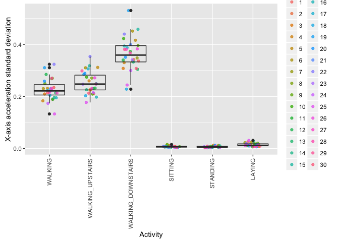

Tidying Smartphone Data - Getting and Cleaning Data Assignment
================
Steve Cooper
April 2016

Abstract
========

In this script, we tidy data files from the [Human Activity Using Smartphones Dataset](http://archive.ics.uci.edu/ml/datasets/Human+Activity+Recognition+Using+Smartphones).

The original data set records 10,299 observations recording one of 30 subjects engaged in one of six activities -- walking, walking upstairs, walking downstairs, sitting, standing, and laying. During each session, a smartphone records accelerometer data over a period of time, so each observation has a large number of values for each of nine observations, such as total x-axis acceleration.

The raw data can be downloaded from [the UC Irvine Website](http://archive.ics.uci.edu/ml/machine-learning-databases/00240/)

This document can be reproduced by running `rmarkdown::render("run_analysis.R", rmarkdown::github_document(), output_file = "README.md")`

Introduction
============

This script produces two data sets. The first contains the same 10,299 rows as the original data set. However, each of the nine types of smartphone variables is summarised by calculating a mean and standard deviation. Some tidying is also performed to convert indentifying numbers into more meaningful character vectors.

The second set summarises the first, producing 180 rows showing the averages for all 30 subjects, for each of the six activities.

Finally, plots are produced which show the summarised data and allow a visual confirmation that the tidying has succeeded.

The Analysis
============

We use these libraries to help tidy and reshape the data, and to display graphs;

``` r
library(dplyr, reshape2, ggplot2)
```

To allow others to reproduce the data, some configuration options are provided. Users can change where the data files live, and which data sets to load;

``` r
options.data.dir <- "./UCI HAR Dataset"
options.datasets <- c("test","train")
options.out.dir  <- "."
options.out.firstSet  <- "firstSet.txt"
options.out.secondSet <- "secondSet.txt"
```

To perform tidying, we must load data from many different files, all of which contain numeric vectors and have a particular naming scheme. We define a function to read files which matches a unique pattern. For instance, if `nameFragment` is `'body_acc_x_'`, it will find `'test/Inertial Signals/body_acc_x_test.txt'`, and `'train/Inertial Signals/body_acc_x_train.txt'`, and read them into a single, long vector.

``` r
readCombinedVector <- function(nameFragment, directory=options.data.dir) {
  # we'll be concatenating together data from all files into this vector;
  vector <- numeric()

  # this gets all the files available in the data directory;
  allFilePaths <- list.files(directory, recursive=TRUE, full.names=FALSE)

  for(sampleName in options.datasets) {
    # create a pattern that will match "<sampleName>.../<fragment>....txt"
    pattern <- sprintf('^%s.*/%s.*\\.txt', sampleName, nameFragment)

    # these indexes are the indexes of files that match
    idx <- grep(pattern, allFilePaths)

    # read the data from the file
    file <- file.path(options.data.dir, allFilePaths[idx])
    dataFromFile <- scan(file, quiet = TRUE)
    #print(sprintf("read %0.0f lines from '%s'", length(dataFromFile), file))

    # join the data from this file into the combined result for all files
    vector <- c(vector, dataFromFile)
  }

  # return the combined result
  vector
}
```

Preparing the first set
=======================

Now the tidying itself. We first load the vector of subjects and the activities these subjects were performing. The subject files contain a list of subject IDs. since this is a categorical variable, it's converted to a factor.

``` r
firstSet <-
  tbl_df(data.frame(subject = factor(readCombinedVector("subject_"))))
```

The activity vector encodes activities like "WALKING" or "WALKING\_UPSTAIRS", but as a numeric vector. We make this more meaningful by associating each number with a name. These labels exist in `activity_labels.txt`, so we're going to load that file to get the right names, and then convert the subject vector into a factor.

``` r
activityLevelFile <- read.fwf(file.path(options.data.dir, 'activity_labels.txt'),
                              widths = c(1,-1,99),
                              col.names = c("id", "factor"),
                              stringsAsFactors=FALSE)
activity.level.names <- activityLevelFile$factor[order(activityLevelFile$id)]
activity.level.factor <- factor(activity.level.names,levels=activity.level.names)

firstSet <- firstSet %>%
  cbind(activity=factor(readCombinedVector("y_"), level=1:6, labels=activity.level.factor))
```

So far, the data looks like this;

<!-- html table generated in R 3.2.5 by xtable 1.8-2 package -->
<!-- Sat Apr 30 01:04:20 2016 -->
<table border="1">
<tr>
<th>
</th>
<th>
subject
</th>
<th>
activity
</th>
</tr>
<tr>
<td align="right">
1
</td>
<td>
2
</td>
<td>
STANDING
</td>
</tr>
<tr>
<td align="right">
2
</td>
<td>
2
</td>
<td>
STANDING
</td>
</tr>
<tr>
<td align="right">
3
</td>
<td>
2
</td>
<td>
STANDING
</td>
</tr>
<tr>
<td align="right">
4
</td>
<td>
2
</td>
<td>
STANDING
</td>
</tr>
<tr>
<td align="right">
5
</td>
<td>
2
</td>
<td>
STANDING
</td>
</tr>
<tr>
<td align="right">
6
</td>
<td>
2
</td>
<td>
STANDING
</td>
</tr>
</table>
Generally in R, `cbind` (column bind) can be used to add columns to an existing table. Here, we use `cbind` with a function which reads a data file (say, total x-axis acceleration), produces the mean and standard deviation, and uses `cbind` to add the two summary values to the data frame `x`. By calling several times, we produce our summary table with mean/sd pairs.

``` r
cbindMeanSd <- function(x, nameFragment, prefix) {
  raw <- readCombinedVector(nameFragment)
  obs <- matrix(raw, nrow=nrow(x), byrow=TRUE)
  summaries <- cbind(apply(obs, 1, mean), apply(obs,1,sd));
  meanName <- paste0(prefix, ".mean")
  sdName <- paste0(prefix, ".sd")
  colnames(summaries) <- c(meanName, sdName)
  cbind(x, summaries)
}
```

all the other files are read in and column-bound to the existing table. Here are a few rows after adding the first variable;

``` r
firstSet <- firstSet %>%
  cbindMeanSd("body_acc_x_", "body_acceleration_x")
```

<!-- html table generated in R 3.2.5 by xtable 1.8-2 package -->
<!-- Sat Apr 30 01:04:23 2016 -->
<table border="1">
<tr>
<th>
</th>
<th>
subject
</th>
<th>
activity
</th>
<th>
body\_acceleration\_x.mean
</th>
<th>
body\_acceleration\_x.sd
</th>
</tr>
<tr>
<td align="right">
1
</td>
<td>
2
</td>
<td>
STANDING
</td>
<td align="right">
-0.00
</td>
<td align="right">
0.02
</td>
</tr>
<tr>
<td align="right">
2
</td>
<td>
2
</td>
<td>
STANDING
</td>
<td align="right">
0.00
</td>
<td align="right">
0.01
</td>
</tr>
<tr>
<td align="right">
3
</td>
<td>
2
</td>
<td>
STANDING
</td>
<td align="right">
-0.00
</td>
<td align="right">
0.00
</td>
</tr>
<tr>
<td align="right">
4
</td>
<td>
2
</td>
<td>
STANDING
</td>
<td align="right">
-0.00
</td>
<td align="right">
0.00
</td>
</tr>
<tr>
<td align="right">
5
</td>
<td>
2
</td>
<td>
STANDING
</td>
<td align="right">
-0.00
</td>
<td align="right">
0.00
</td>
</tr>
<tr>
<td align="right">
6
</td>
<td>
2
</td>
<td>
STANDING
</td>
<td align="right">
0.00
</td>
<td align="right">
0.00
</td>
</tr>
</table>
and here, we add the rest of the data;

``` r
firstSet <- firstSet %>%
  cbindMeanSd("body_acc_y_", "body_acceleration_y") %>%
  cbindMeanSd("body_acc_z_", "body_acceleration_z") %>%
  cbindMeanSd("total_acc_x_", "total_acceleration_x") %>%
  cbindMeanSd("total_acc_y_", "total_acceleration_y") %>%
  cbindMeanSd("total_acc_z_", "total_acceleration_z") %>%
  cbindMeanSd("body_gyro_x_", "body_angular_velocity_x") %>%
  cbindMeanSd("body_gyro_y_", "body_angular_velocity_y") %>%
  cbindMeanSd("body_gyro_z_", "body_angular_velocity_z")
```

finally, we order by subject and activity.

``` r
firstSet <- firstSet %>% arrange(subject, activity)
```

Preparing the second set
========================

Preparing the second set is fairly straightforward. We melt into a narrow format, then re-assemble, using the mean function to summarise by subject and activity.

``` r
melted <- melt(firstSet, id=c("subject", "activity"))
```

The melted data looks something like this;

<!-- html table generated in R 3.2.5 by xtable 1.8-2 package -->
<!-- Sat Apr 30 01:04:42 2016 -->
<table border="1">
<tr>
<th>
</th>
<th>
subject
</th>
<th>
activity
</th>
<th>
variable
</th>
<th>
value
</th>
</tr>
<tr>
<td align="right">
94
</td>
<td>
1
</td>
<td>
WALKING
</td>
<td>
body\_acceleration\_x.mean
</td>
<td align="right">
-0.02
</td>
</tr>
<tr>
<td align="right">
95
</td>
<td>
1
</td>
<td>
WALKING
</td>
<td>
body\_acceleration\_x.mean
</td>
<td align="right">
-0.01
</td>
</tr>
<tr>
<td align="right">
96
</td>
<td>
1
</td>
<td>
WALKING\_UPSTAIRS
</td>
<td>
body\_acceleration\_x.mean
</td>
<td align="right">
-0.02
</td>
</tr>
<tr>
<td align="right">
97
</td>
<td>
1
</td>
<td>
WALKING\_UPSTAIRS
</td>
<td>
body\_acceleration\_x.mean
</td>
<td align="right">
0.00
</td>
</tr>
<tr>
<td align="right">
98
</td>
<td>
1
</td>
<td>
WALKING\_UPSTAIRS
</td>
<td>
body\_acceleration\_x.mean
</td>
<td align="right">
0.00
</td>
</tr>
<tr>
<td align="right">
99
</td>
<td>
1
</td>
<td>
WALKING\_UPSTAIRS
</td>
<td>
body\_acceleration\_x.mean
</td>
<td align="right">
0.00
</td>
</tr>
<tr>
<td align="right">
100
</td>
<td>
1
</td>
<td>
WALKING\_UPSTAIRS
</td>
<td>
body\_acceleration\_x.mean
</td>
<td align="right">
-0.01
</td>
</tr>
</table>
Now we `dcast` (un-melt), grouping by subject and activity and averaging the other variables;

``` r
secondSet <- dcast(melted, subject + activity ~ variable, mean)
```

Here's a part of the second set.

<!-- html table generated in R 3.2.5 by xtable 1.8-2 package -->
<!-- Sat Apr 30 01:04:42 2016 -->
<table border="1">
<tr>
<th>
</th>
<th>
subject
</th>
<th>
activity
</th>
<th>
body\_acceleration\_x.mean
</th>
<th>
body\_acceleration\_x.sd
</th>
</tr>
<tr>
<td align="right">
3
</td>
<td>
1
</td>
<td>
WALKING\_DOWNSTAIRS
</td>
<td align="right">
0.00
</td>
<td align="right">
0.34
</td>
</tr>
<tr>
<td align="right">
4
</td>
<td>
1
</td>
<td>
SITTING
</td>
<td align="right">
-0.00
</td>
<td align="right">
0.01
</td>
</tr>
<tr>
<td align="right">
5
</td>
<td>
1
</td>
<td>
STANDING
</td>
<td align="right">
0.00
</td>
<td align="right">
0.00
</td>
</tr>
<tr>
<td align="right">
6
</td>
<td>
1
</td>
<td>
LAYING
</td>
<td align="right">
-0.01
</td>
<td align="right">
0.02
</td>
</tr>
<tr>
<td align="right">
7
</td>
<td>
2
</td>
<td>
WALKING
</td>
<td align="right">
-0.00
</td>
<td align="right">
0.19
</td>
</tr>
<tr>
<td align="right">
8
</td>
<td>
2
</td>
<td>
WALKING\_UPSTAIRS
</td>
<td align="right">
-0.01
</td>
<td align="right">
0.23
</td>
</tr>
<tr>
<td align="right">
9
</td>
<td>
2
</td>
<td>
WALKING\_DOWNSTAIRS
</td>
<td align="right">
0.00
</td>
<td align="right">
0.34
</td>
</tr>
</table>
To confirm that data makes some sense, here are two plots of the x-axis acceleration's stanard deviation. If this is high, it means the subject is moving about laterally at many different speeds, indicating movement. If low, it indicates a sedentary activity. If we have done the tidying correctly, we would expect the sitting, standing, and laying numbers to be very low, while the walking ones to be higher, and this is exactly what we see

This plots the first set of 10299 records

<!-- -->

This plot confirms the analysis for the second data set of 180 records.

<!-- -->
